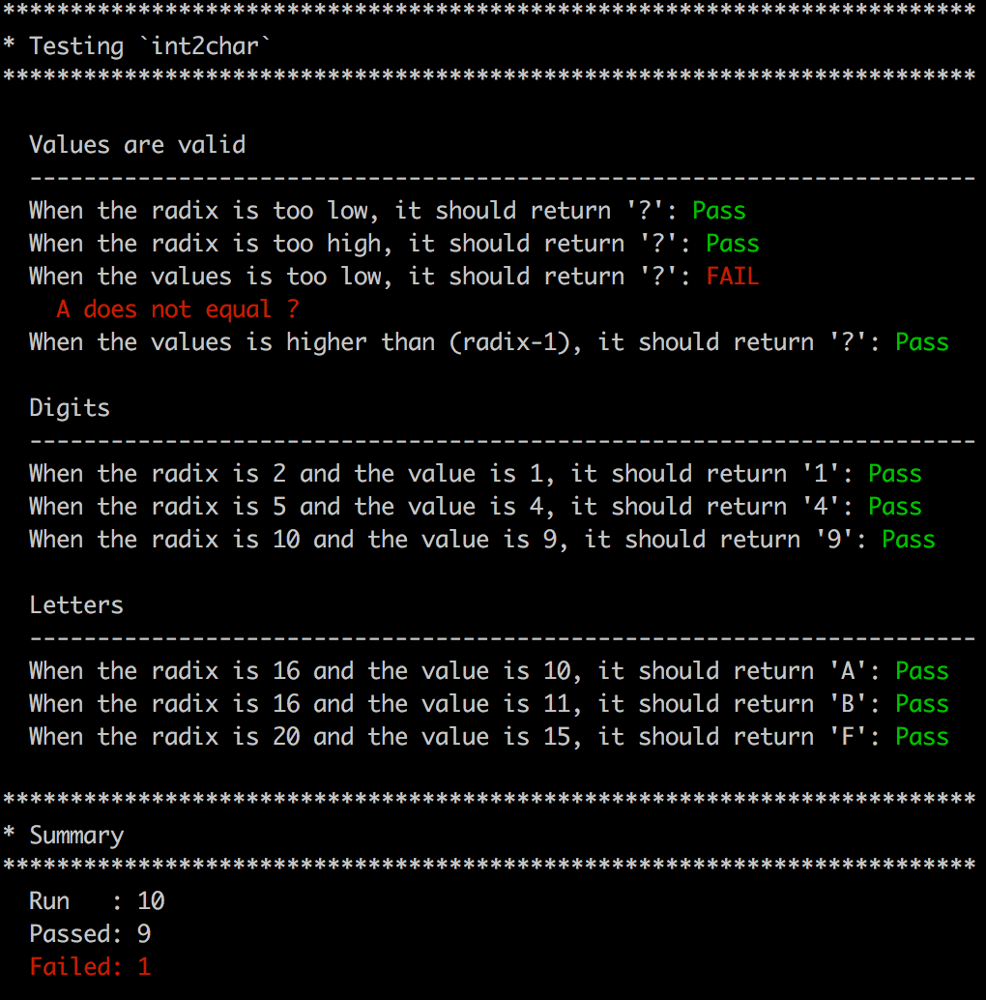

# CSPEC
Super simple unit testing and assertions for C.

# Usage
## Setup
Suppose we want to test the `int2char` function from the `toTest.c` file.

First, create a `tests.c` file to contain your specs and include the code to be tested as well as `cspec`:
```
#include <stdio.h>
#include "toTest.h"
#include "../src/cspec.h"
```

In the `main` method create your tests organized with headers and make assertions
```
int main (int argc, char* argv[]) {
  printHeader("Testing `int2char`");

  printSubHeader("Values are valid");
  printf("  When the radix is too low, it should return '?':");
  assertEqualChar(int2char(0, 33), '?');

  printSubHeader("Digits");
  printf("  When the radix is 2 and the value is 1, it should return '1':");
  assertEqualChar(int2char(2, 1), '1');

  return 0;
}
```

cspec will run each test in order and indicate success based on the use of an assertion.

A summary is compiled during the run which can be printed using `printTestSummary();`.

## Execution
To run the test suite, simply compile and execute `tests.c`:
```
gcc -g -Wall toTest.c cspec.c tests.c -o tests
./tests
```

I recommend you wrap this in a simple bash script named `run` to compile and run the suite in a single step.
```
#!/usr/bin/env bash

gcc -g -Wall toTest.c cspec.c tests.c -o tests
./tests
```

Now simply use ./run to compile and execute the suite.

# Example
There is a more complete example [here](example/tests.c).

Here is the output:

